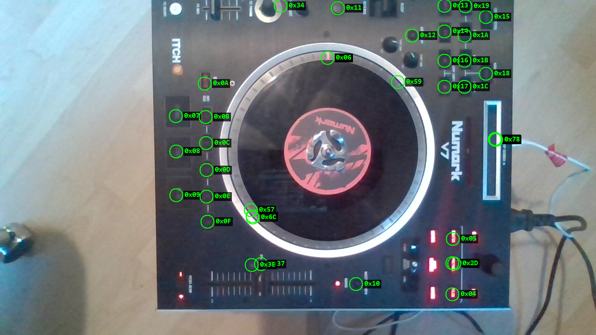

# Numark V7 — control map

Full two-way map of the V7's control surface: every control the device reports,
and every LED / motor command the host can send.

## Provenance and confidence

Two independent sources, marked per row:

- ✅ **Measured on this hardware** — confirmed by OpenV7 through the Windows
  vendor driver's MIDI port, using the platter position counter as a
  tachometer. See [PROTOCOL.md](PROTOCOL.md).
- 🔬 **Cross-referenced, not yet confirmed on hardware** — addresses extracted
  from the community Mixxx mapping for the V7
  (`res/controllers/Numark V7.midi.xml` and `Numark-V7-scripts.js`, by Mike
  Bucceroni, GPL-2.0). Only the factual MIDI addresses are reproduced here; no
  code was copied.

**The two sources agree everywhere they overlap.** Every motor command OpenV7
measured independently — `0x43` start, `0x44` stop, `0x45` RPM select, `0x46`
reverse, `0x47`/`0x48` ramp times, `0x49`+`0x69` pitch trim — appears in the
Mixxx map with the same meaning. That mutual corroboration is the main reason
to trust the 🔬 rows, but they are still unverified on a physical unit.

Caveat: the Mixxx mapping has internal inconsistencies (several deck-B handlers
are bound to `[Channel1]`), so treat its *deck assignment* with more suspicion
than its *addresses*.

## Structural rules

The address space is laid out in regular blocks, which is the fastest way to
sanity-check any single row:

| Block | Deck A | Deck B | Offset |
|---|---|---|---|
| Buttons (device → host, note-on) | `0x0F`–`0x2B` | `0x30`–`0x4C` | **+0x21** |
| LEDs (host → device, CC) | `0x07`–`0x1C` | `0x1D`–`0x33` | **+0x16** |
| Motor (host → device, CC) | `0x43`–`0x49` | `0x4D`–`0x53` | **+0x0A** |

Continuous controls use the standard MIDI 14-bit convention — **coarse on CC
`n`, fine on CC `n+32`** — which is the same pairing the motor pitch trim uses
(`0x49` / `0x69`).

---

## Input — device → host (bulk IN `0x83`)

### Platter and continuous controls (CC, status `0xB0`)

| CC A | CC B | Control | Confidence |
|---|---|---|---|
| `0x00` | `0x02` | **Platter position** — 7-bit wrapping counter, 3600 counts/rev | ✅ |
| `0x04` + `0x24` | `0x05` + `0x25` | **Pitch fader** (coarse + fine, 14-bit) | ✅ |
| `0x45` | `0x4D` | **Strip search** (needle strip) | ✅ |
| `0x46` | `0x4E` | **Motor START TIME knob** | ✅ |
| `0x47` | `0x4F` | **Motor STOP TIME knob** | ✅ |
| `0x44` | — | **Browse / track select knob** | ✅ |
| `0x58` | `0x56` ⚠️ | FX parameter — ⚠️ **RELATIVE**, not absolute | `0x58` ✅ measured; the deck split is **not** |
| `0x57` + `0x77` | `0x59` + `0x79` | FX slider (coarse + fine) | ✅ |
| `0x5A` | `0x5B` | FX select — ⚠️ **RELATIVE**; deck pair, both halves measured | ✅ |

> ⚠️ **FX PARAM's deck split is inferred, not measured.** Only `0x58` has been
> seen on the wire, and the capture that produced it did not record the DECK
> SELECT position — the exact mistake the FX SELECT note below warns about.
> `0x56` is listed as its deck-B partner because the two arrived together, but
> that assignment fits **no** block offset on this device: every other block runs
> deck B *above* deck A (buttons +`0x21`, LEDs +`0x16`, motor +`0x0A`, FX slider
> +`0x02`), and `0x56` is *below* `0x58`. It may well be the other way round.
>
> The tester binds both addresses, so the knob lights on either deck regardless;
> only the A/B labelling is at stake. **To settle it:** turn FX PARAM with the
> switch on A, then on B, recording the switch position with each capture.

Each platter position message is paired 1:1 with a `0xE0` pitch-bend carrying a
14-bit timestamp on a **2,822,400 Hz** clock ✅ — that pairing is what yields
velocity. A stationary platter sends nothing at all ✅.

> ### ✅ BLEEP / REVERSE is a three-position switch — both halves measured
>
> | Note | Position | Behaviour |
> |---|---|---|
> | `0x1C` | **BLEEP** (up) | **Momentary** — `7F` while held, `00` on release |
> | `0x1D` | **REVERSE** (down) | **Latching** — `7F` held for 11.5 s across a switch throw, `00` only when moved back |
>
> Centre is the rest position and reports nothing. The earlier entry listed the
> pair as "REVERSE / CENSOR" in `0x1C`,`0x1D` order, which is the wrong way
> round: the latching detent is `0x1D`.
>
> ⚠️ **BLEEP bounces hard.** One flick produced up to a dozen `7F`/`00` pairs in
> a second as the spring lever chattered back. A host that acts on every edge
> will re-trigger the censor repeatedly; debounce before driving playback.
>
> ### ✅ Phantom `CC 0x00` messages were a host-side byte loss, not a control
>
> The "constant-valued CC `0x00` / `0x01`" anomaly recorded above was **not**
> coming from the device. A BLEEP-bounce capture produced `90 00 1C` in the
> middle of a clean run of `90 1C 7F` / `90 1C 00`: the byte pairing had shifted
> by one, i.e. a byte was lost, not a message invented.
>
> Cause was in the bridge, not the protocol: only ONE bulk-IN transfer was in
> flight on `0x83`, so between a transfer completing and its callback
> resubmitting, nothing was armed and anything arriving in that gap was dropped.
> Bursty traffic — switch bounce, platter spam — hits that window. Fixed with a
> ring of queued transfers; re-running the same stress case gave 35 messages and
> zero malformed, where the single-transfer build desynced within 5 s.
>
> **Anyone reverse-engineering this device from a host capture should rule out
> their own receive path before recording a surprising address.** This one nearly
> entered the map as a real control.

> ### ✅ Library buttons resolved — PREPARE / FILES / CRATES
>
> These were recorded here as a cluster with "individual assignment unconfirmed".
> Pressing each in turn through the bridge gave one distinct note per button:
>
> | Note | Button |
> |---|---|
> | `0x09` | **PREPARE** |
> | `0x0A` | **FILES** |
> | `0x0B` | **CRATES** |
>
> Note this is **not** the panel's left-to-right order (CRATES, PREPARE, FILES),
> so assigning these by position — the obvious guess, and the one made first —
> gets all three wrong.
>
> **Independently corroborated by the LED map.** The camera probe on Windows
> found the output trio `0x03`/`0x04`/`0x05` to be PREPARE / FILES / CRATES, in
> that same ascending order. Two unrelated methods — photographing lamps on
> Windows, and reading note-ons on macOS — agree on the ordering.

> ### ✅ Knob presses and encoder behaviour — measured on macOS
>
> Captured from the live device through the OpenV7 bridge (`openv7 -v`):
>
> | Address | Control | Evidence |
> |---|---|---|
> | note `0x08` | **BROWSE knob PRESS** | `90 08 7F` / `90 08 00`, seven press/release pairs |
> | note `0x53` / `0x5A` | **FX SELECT knob PRESS** | deck A `90 53 7F` / `90 53 00`; deck B `90 5A …` |
> | CC `0x5A` / `0x5B` | **FX SELECT rotation** | deck A `B0 5A 7F` repeated; 16 consecutive `01` the other way |
> | CC `0x58` | **FX PARAM rotation** | `7F 7F 7F … 01 01 01` |
>
> This resolves `0x08`, previously recorded here only as "not LOAD PREPARE" with
> its panel label unknown, and listed as an open question in HANDOFF-MAC.md.
>
> ⚠️ **The FX SELECT rows above were originally recorded WITHOUT which deck the
> A/B switch was on**, as flat "press = `0x5A`, rotation = `0x5B`". Both were
> deck-B addresses. FX SELECT is a deck pair like its neighbours — `0x52`/`0x59`
> FX ON and `0x54`/`0x5B` MASTER — so its press is `0x53` on A and `0x5A` on B.
> Re-measured on 2026-08-23 with the switch on **A**: press `90 53 7F` /
> `90 53 00`, rotation `B0 5A 7F`. The tester had taken the old note literally
> and mapped only `0x5A` into its deck-A slot, so pressing FX SELECT on deck A
> lit nothing while the rotation worked. **Always record the switch position
> alongside a per-deck measurement** — a bare address is only half the fact.
>
> **FX PARAM is a relative encoder, not an absolute knob.** It sends `0x01` /
> `0x7F` for direction exactly as BROWSE and FX SELECT do — no position, no
> centre, no end stops. The earlier entry implied a 0..127 knob; a host that
> renders it as one pegs the indicator at an end and it never moves. The deck's
> three relative encoders are BROWSE (`0x44`), FX SELECT (`0x5A` on deck A /
> `0x5B` on deck B) and FX PARAM (`0x58`).
>
> ⚠️ **Open:** in the same capture CC `0x00` arrived 102 times with a constant
> value `02`, and CC `0x01` 33 times with a constant `00`. Constant values are
> neither position nor relative-encoder data. A deck switch to A (`B0 7D 00`)
> during that capture explains why the deck-A block appeared at all, but not the
> constant values. Unexplained; not chased.

> ⚠️ **Input and output CC numbers overlap and do not mean the same thing.**
> ### ✅ Strip search — releasing sends `0`
>
> The address was known (`B0 45` deck A, `B0 4D` deck B, absolute 7-bit). The
> behaviour was not, and it is the part that decides whether a needle-drop
> mapping works.
>
> Measured over 15 gestures on Windows: **lifting a finger emits value `0`.**
> The pattern is unmistakable when gestures are split on a 300 ms gap —
> a touch, then a release burst ending at zero:
>
> ```
> gesture 10   n=4  27 .. 26        <- tap held at ~27
> gesture 11   n=3  28 .. 0         <- release
> gesture 12   n=4  117 .. 124      <- tap at ~120
> gesture 13   n=4  123 .. 0        <- release
> gesture 14   n=4  78 .. 94
> gesture 15   n=5  93 .. 0         <- release
> ```
>
> Two gestures were a lone `n=1, value 0` — the release arriving more than
> 300 ms after the touch ended, so it grouped separately.
>
> ⚠️ **`0` is therefore ambiguous**: it is both "finger lifted" and "finger at
> the very bottom of the strip". A host that treats the strip as a plain
> absolute position will jump the playhead to the start of the track **every
> time the finger leaves**, which presents as a broken mapping but is the
> protocol working as designed. Disambiguate by treating a `0` that follows a
> non-zero value as a release, not a position.

> Input CC `0x45` is the deck-A strip search; output CC `0x45` is motor RPM
> select. Input `0x46`/`0x47` are the start/stop-time knobs; output `0x46` is
> motor direction and `0x47`/`0x48` are the ramp times. Direction disambiguates
> them — a bridge must not treat the control map as symmetric.

### Buttons (note-on, status `0x90`)

Deck B = deck A + `0x21`, **measured** — with the A/B switch moved mid-capture,
PLAY appeared as both `0x11` and `0x32`, CUE as `0x10`/`0x31`, SYNC as
`0x0F`/`0x30`, and the hot cues as `0x13`–`0x17` / `0x34`–`0x38`.

**Every address below has been seen on the wire**, with the single exception of
`0x7D`, which the evidence says is a phantom rather than a gap (see below). The
Mixxx key names remain the source for *what each control does*; the "likely
control" column is inference from those names and is **not** authoritative
— `0x12` is a case where it turned out to be wrong.

**Press and release:** buttons send `90 nn 7F` down and `90 nn 00` up —
note-on with zero velocity, **never** note-off `0x80` ✅. Code that listens for
`0x80` will miss every release.

| Note A | Note B | Mixxx key | Likely control |
|---|---|---|---|
| `0x0F` | `0x30` | `beatsync` | SYNC |
| `0x10` | `0x31` | `cue_default` | CUE |
| `0x11` | `0x32` | `Play` | PLAY / PAUSE |
| `0x12` | `0x33` | `Shift` | **DELETE** (SHIFT is its alt function) |
| `0x13`–`0x17` | `0x34`–`0x38` | `Hot1`–`Hot5` | **HOT CUE 1–5** |
| `0x18` | `0x39` | `rate_temp_down` | PITCH BEND − |
| `0x19` | `0x3A` | `rate_temp_up` | PITCH BEND + |
| `0x1A` | `0x3B` | `RateRange` | PITCH RANGE |
| `0x1B` | `0x3C` | `keylock` | KEY LOCK |
| `0x1C`, `0x1D` | `0x3D`, `0x3E` | `Reverse` | REVERSE / CENSOR |
| `0x1E` | `0x3F` | `bpm_tap` | TAP |
| `0x21` | `0x42` | `MotorOffButton` | MOTOR ON/OFF |
| `0x22` | `0x43` | `loop_halve` | LOOP ½ |
| `0x23` | `0x44` | `loop_double` | LOOP ×2 |
| `0x24` | `0x45` | `reloop_exit` | RELOOP / EXIT |
| `0x25` | `0x46` | `LoopShiftDown` | LOOP SHIFT ◀ |
| `0x26` | `0x47` | `LoopShiftUp` | LOOP SHIFT ▶ |
| `0x27` | `0x48` | `LoopMode` | LOOP MODE |
| `0x28` | `0x49` | `loop_in` | LOOP IN |
| `0x29` | `0x4A` | `loop_out` | LOOP OUT |
| `0x2A` | `0x4B` | `Select` | SELECT |
| `0x2B` | `0x4C` | `Reloop` | RELOOP |

> ⚠️ **`0x24` is labelled two different things in this repo, and neither is
> measured.** This table calls it RELOOP / EXIT (from the Mixxx key
> `reloop_exit`); the app's panel calls it LOOP CONTROL. They cannot both be
> right, and `0x2B` is *separately* mapped as RELOOP in both places, so one of
> the two is a duplicate.
>
> Remember what the "Likely control" column means: **the addresses in this table
> are measured, the functions are not.** They come from the Mixxx mapping, which
> is a corroborating source and not this hardware. Recorded rather than resolved
> because resolving it needs someone at a V7 pressing the button in the loop
> section and reading the note number — not another round of inference.

Non-deck buttons:

| Note | Mixxx key | Likely control |
|---|---|---|
| `0x06` / `0x07` | `SelectPrev/NextPlaylist` | BACK / FWD (browse) |
| `0x08` | `LoadSelectedIntoFirstStopped` | ✅ **BROWSE knob PRESS** — measured on the Mac |
| `0x0D` | `LoadSelectedIntoFirstStopped` | **LOAD PREPARE** ✅ confirmed by pressing it |
| `0x09` / `0x0A` / `0x0B` | *(absent from the Mixxx map)* | ✅ **PREPARE / FILES / CRATES** — measured individually, see below |
| `0x0C` / `0x0E` | `LoadSelectedTrack` ch1 / ch2 | LOAD A / LOAD B |
| `0x52` / `0x59` | `flanger` ch1 / ch2 | FX ON A / B |
| `0x53` / `0x5A` | `FxSelect` | FX SELECT |
| `0x54` / `0x5B` | `MasterL` / `MasterR` | MASTER L / R |
| `0x5C` | `DeckSelectL` | **A/B switch event** (fires both directions; position is `B0 7D`) |
| `0x7D` | `DeckSelectR` | ⚠️ **phantom** — no such control on a V7 |

---

## Output — host → device (bulk OUT `0x04`)

All output is **CC on status `0xB0`** — note-on does *not* drive the LEDs. Send
one MIDI message per 42-byte `0xFD`-padded frame.

### LEDs

Deck B = deck A + `0x16`.

**✅ LEDs are binary — there is no brightness control.** Tested by holding one
lamp at `0x01`, `0x40` and `0x7F` for five seconds each, three times over: no
visible difference at any value. A blink test at `0x7F`/`0x00` on the same lamp
confirmed it was responding, so the null result is real rather than an LED that
never lit.

So `0x00` = off and **any non-zero value = fully on**. Do not expect dimming,
and do not waste time hunting for a velocity curve. Multi-state feedback has to
be done by blinking in software.

*(The `0x34`/`0x35`/`0x36` group is the exception — it takes ordinal values
`0x00`–`0x0C` and is a display or position indicator rather than a lamp.)*

| CC A | CC B | Lights | Confidence |
|---|---|---|---|
| `0x07` | `0x1D` | SYNC | 🔬 |
| `0x08` | `0x1E` | CUE | 🔬 |
| `0x09` | `0x1F` | PLAY | 🔬 |
| `0x0A`–`0x0F` | `0x20`–`0x25` | Shift-layer LEDs (6) | 🔬 |
| `0x10` | `0x27` | KEY LOCK | 🔬 |
| `0x11` | `0x28` | TAP | 🔬 |
| `0x12` | `0x29` | MOTOR OFF | 🔬 |
| `0x13` | `0x2A` | LOOP ½ | 🔬 |
| `0x14` | `0x2B` | LOOP ×2 | 🔬 |
| `0x15` | `0x2C` | LOOP ON/OFF | 🔬 |
| `0x16` | `0x2D` | LOOP SHIFT ◀ | 🔬 |
| `0x17` | `0x2E` | LOOP SHIFT ▶ | 🔬 |
| `0x18`–`0x1C` | `0x2F`–`0x33` | LOOP MODE (5) | 🔬 |
| `0x37` | `0x38` | **Pitch-at-zero indicator** — verified *not* a motor command ✅ | ✅/🔬 |
| `0x3C` | `0x3D` | FX button | 🔬 |

### ✅ LED addresses located on the panel by camera

The device has no LED feedback channel, so the only way to see which command
drives which lamp is to look. `tools/win/led-cam-probe.ps1` automates that: it
photographs the panel, sends one CC, photographs again, and finds the brightest
changed cluster. **44 CCs were confirmed to drive a real lamp**, and their
positions corroborate the addresses above:

| Documented | Where the camera found it | |
|---|---|---|
| `0x07`/`0x08`/`0x09` — SYNC / CUE / PLAY A | column of 3, x≈378 | ✅ the transport column |
| `0x0A`–`0x0F` — shift-layer LEDs (6) | column of 6, x≈442 | ✅ |
| `0x13`–`0x1C` — loop block | cluster, top right | ✅ |
| `0x03`/`0x04`/`0x05` — PREPARE / FILES / CRATES | vertical trio, x≈971 | ✅ |



Each circle marks where that CC's lamp lit. Full coordinates are in
`captures/v7-led-cam-final.json`.

Two caveats on that data:

- **27 of the 44 are strong hits** (≥60 changed pixels in the hotspot cell).
  The other 17 — `0x01`, `0x02`, `0x06`, `0x10`, `0x12`, `0x1E`, `0x20`–`0x23`,
  `0x2D`, `0x2E`, `0x34`, `0x59`, `0x6C`, `0x77`, `0x78` — are weak and some may
  be artifacts.
- **Several addresses share one location.** `0x01`/`0x02`/`0x06` all light
  (703,124), and `0x1E`/`0x20`–`0x23` all light (1063,299). That is the
  signature of a multi-state indicator or display rather than separate lamps,
  and matches the `0x34`/`0x35`/`0x36` group taking values 0–12.

**LEDs appear to follow the A/B switch, like inputs do.** With the switch in one
position the deck-A LED block (`0x07`–`0x1C`) lit almost completely, while the
deck-B block (`0x1D`–`0x33`) largely did not respond.

> Method note: this needs the camera, the deck and the lighting to stay still.
> Two runs were silently ruined before a guard was added — the giveaway was
> hotspots piling up at the frame edge with 25,000+ changed pixels, which is a
> scene change, not a lamp. The probe now rejects such frames and says so.
> Comparing a fresh off/on pair per CC, rather than one shared baseline, is what
> made it robust: the laptop screen faces the deck and its own output changes
> the light falling on the panel.

Global / shared:

| CC | Function | Confidence |
|---|---|---|
| `0x03` / `0x04` / `0x05` | PREPARE / FILES / CRATES browse LEDs | 🔬 |
| `0x34`, `0x35`, `0x36` | **Numeric display / ring** — values `0x00`–`0x0C`, driven as a group of three | 🔬 |
| `0x39` | **All-LED flash / all-off** | 🔬 |

`0x34`/`0x35`/`0x36` take a small ordinal (0–12) rather than an on/off, and the
Mixxx script drives all three together — consistent with a segmented display or
a 12-position indicator ring rather than discrete lamps.

### Motor (deck B = deck A + `0x0A`)

**Both decks measured on hardware.** The V7 has a physical A/B switch, and it
selects which command block the device answers on — so deck B was verified
directly rather than inferred.

| CC A | CC B | Function | Deck A | Deck B |
|---|---|---|---|---|
| `0x41` | `0x4B` | **Instant start** | ✅ | ✅ 33.33 RPM |
| `0x42` | `0x4C` | **Instant stop** | ✅ | ✅ 0 RPM |
| `0x43` | `0x4D` | Soft start | ✅ | ✅ |
| `0x44` | `0x4E` | Brake | ✅ | ✅ |
| `0x45` | `0x4F` | RPM select — `00` = 33⅓, `01` = 45 | ✅ | ✅ 33.33 / 45.00 |
| `0x46` | `0x50` | Direction — `01` = reverse, latched while stopped | ✅ | ✅ −33.33 RPM |
| `0x47` | `0x51` | Start ramp time | ✅ | ✅ |
| `0x48` | `0x52` | Brake ramp time | ✅ | ✅ |
| `0x49`+`0x69` | `0x53`+`0x73` | Pitch trim, signed 14-bit | ✅ | ✅ matches the law to 0.17 RPM |

`0x41`/`0x42` (instant start/stop) appear in **no** other source — not the
community mapping, not the vendor driver strings — and `0x4B`/`0x4C` were pure
inference from the block offset until they were tested. Both work.

### The A/B switch ("DECK LOCATION SWITCH"), and what it proves

The manual calls this rear-panel control the **DECK LOCATION SWITCH** and
describes it as *"reserved for future use"*. It is not: it selects which deck's
command block the unit answers on, and that is directly measurable.


With the switch on B:

- `B0 43 00` (deck-A soft start) produces **zero** messages and no motion;
- `B0 4D 00` (deck-B soft start) spins the platter and reports position on
  **CC `0x02`**, at the same 998.8/s, still paired 1:1 with pitch-bend.

So the switch re-routes the whole command block, and the **+`0x0A` motor offset
is proven rather than assumed**. CC `0x02` as deck-B platter position is
likewise now confirmed, not cross-referenced.

This matters beyond the motor: it is direct evidence that the block-offset model
in the table at the top of this document is real, which raises confidence in the
button (+`0x21`) and LED (+`0x16`) offsets even though those rows are still 🔬.
Operating a control in each switch position would confirm those the same way.

Full semantics for the motor commands — including the reverse latching gotcha
and the pitch-trim law — are in [PROTOCOL.md](PROTOCOL.md).

---

## Confirmation status: 84 of 89 inputs measured

The input addresses below were checked against the hardware by operating the
panel and recording what arrived (`tools/win/midi-observe.ps1`). **84 of the 89
documented addresses appeared**, and — worth noting — the device emitted
**nothing outside the documented set**, so the cross-referenced map contains no
phantom entries.

**88 of the 89 have now been seen on the wire.** The single exception is
`90 7D` "DECK SELECT R", and the evidence says it is a **phantom** rather than a
gap — see the deck-select section below.

### The A/B switch — `90 5C` and `B0 7D` ✅

Flipping the rear-panel switch produces, in one burst:

```text
90 5C 7F      deck-select event      (and 90 5C 00 on release)
B0 7D 01      switch POSITION        00 = deck A, 01 = deck B
B0 4D / 4F / 59 / 79 / 4E ...        state dump of the new deck's controls
```

Three things follow:

- **`90 5C` is not "deck select LEFT".** It fires in *both* directions — it was
  observed when switching **to B**. It is the switch *event*; the resulting
  position is reported separately by `B0 7D`.
- **`90 7D` "DECK SELECT R" therefore has nothing to press.** A V7 has one
  switch, not a left and a right button. That entry was almost certainly
  inherited from the NS7, which does have two decks. Treat it as a phantom.
- **`B0 7D` is not a heartbeat.** PROTOCOL.md recorded `B0 7D` as idle chatter;
  it is the deck-position report.

**Flipping the switch also dumps control state.** The device re-reports the
current position of every continuous control in the newly selected deck's
address block. That is the only occasion on which the V7 volunteers control
state without the control being moved, and it is how a host can learn fader and
knob positions at startup.

### ✅ Rear-panel switches — new, in no published mapping

Both rear switches report to the host. Neither appears in the Mixxx mapping, in
the vendor driver's strings, or anywhere else found:

| Address | Control | Observed |
|---|---|---|
| `90 55` | **DECK LOCATION** (deck sits left or right of the mixer) | `7F` / `00` |
| `90 58` | **MOTOR TORQUE** (high / low platter feel) | `7F` / `00` |

The velocity encodes the **switch position**, not press-and-release — these are
toggles, so there is no release event to report.

Worth noting the manual describes DECK LOCATION as *"reserved for future use"*.
It is not: it reports on every change.

`90 58` is the more useful of the two for a host. Motor torque changes how the
platter feels under the hand, and without this a host would have no way to know
the setting.

> These two were found by testing the rear panel specifically, after the front
> controls were exhausted. Worth remembering that a "complete" control map
> derived from software mappings can miss whole controls — a published mapping
> only contains what its author chose to map.

### ⚠️ Output must follow the switch

**The device ignores the non-selected deck's block entirely.** This is measured,
not inferred: with the switch on B, `B0 43 00` (deck-A soft start) produced
**zero** messages and no motion, while `B0 4D 00` spun the platter immediately.

So a bridge must track `B0 7D` and address **motor and LED commands to whichever
block is currently live**:

| | Deck A | Deck B |
|---|---|---|
| Motor | `0x41`–`0x49` (+`0x69`) | `0x4B`–`0x53` (+`0x73`) |
| LEDs | `0x07`–`0x1C` | `0x1D`–`0x33` |

Send to the wrong block and the device **silently does nothing** — no error, no
stall, just no effect. That failure mode is easy to misread as a broken command
or a dead pipe.

### Driving four virtual decks

The V7 has one deck-select switch, but a host can map four decks by combining it
with the DELETE/SHIFT modifier:

| Switch (`B0 7D`) | Modifier | Virtual deck |
|---|---|---|
| `00` (A) | — | 1 |
| `00` (A) | SHIFT held | 3 |
| `01` (B) | — | 2 |
| `01` (B) | SHIFT held | 4 |

Two protocol features make this workable rather than a hack:

- **`B0 7D` announces the switch position** the moment it changes, so the host
  never has to guess which deck is live.
- **The state dump on switch-flip enables soft takeover.** Because the device
  re-reports every continuous control's current position in the new block,
  the host can reconcile physical positions with the newly selected deck instead
  of snapping the pitch fader to wherever the hardware happens to sit.

The limit is physical, not protocol: one platter and one pitch fader means four
*mappable targets you switch between*, not four you can operate at once.

### ✅ SHIFT is not a firmware layer — the host must implement it

Tested by holding SHIFT and pressing PLAY, CUE, two hot cues, LOOP IN and FX ON.
Every one produced its **normal** address (`0x32`, `0x31`, `0x34`, `0x35`,
`0x49`, `0x59`) and **no new addresses appeared at all**.

So the device does not remap anything while SHIFT is held. It is an ordinary
button that reports its own press and release like any other; a host wanting a
shift layer has to track that state and interpret combinations itself.

Worth stating explicitly because the opposite is a reasonable assumption — many
controllers *do* expose a shifted address space, and someone could spend a while
hunting for one here.

### `0x12` / `0x33` is the DELETE button, not "SHIFT"

The Mixxx mapping names these `Shift`. On the V7's panel the button is labelled
**DELETE**, with SHIFT printed above it as its alternate function. Same physical
key, but anyone mapping "SHIFT" will hunt for a button that is not labelled that.

## Why the LED labels are still 🔬

Every non-contact avenue for confirming the LED labels has been tried and failed:

- **A control-state dump at init.** Many controllers report the position of
  every fader and knob when the driver attaches. Captured a full driver
  re-init: the V7 sends **nothing** on bulk IN `0x83` afterwards.
- **An idle heartbeat to piggyback on.** There is none — 45 seconds of
  hands-off capture contains zero `0x83` packets.
- **A query/response channel.** Ruled out twice. Sweeping every CC and note-on
  across `0x00`–`0x7F` through the MIDI port drew no reply, and repeating the
  sweep **at the raw USB level** (below the vendor driver's MIDI filtering,
  `tools/win/capture-sweep.ps1`) confirms it: 996 outbound packets on bulk OUT
  `0x04`, and endpoint `0x83` produced **no inbound packets at all** — it does
  not even appear in the capture's endpoint totals. The only request/response
  path on the device is the SysEx identity inquiry, which returns a fixed
  string.

  So the V7 is strictly **write-only for LEDs and read-only for controls**.
  There is no way to interrogate an LED's state or a control's position; the
  device volunteers a control's value only when it physically moves.
- **A second independent published mapping** to corroborate the Mixxx
  addresses. None exists publicly for the V7.

The device only speaks when a control is physically moved, so the remaining
rows need a person at the controller. The platter is the exception and is
already ✅ — it can be driven by the motor commands and read back through its
own position counter, which is how the motor set was measured.

## Confirming the 🔬 rows

Both directions can be verified on hardware with the Windows tooling:

```powershell
powershell -ExecutionPolicy Bypass -File .\tools\win\midi-learn.ps1   # inputs
powershell -ExecutionPolicy Bypass -File .\tools\win\led-probe.ps1    # outputs
```

`midi-learn` watches for a control gesture and asks what it was; `led-probe`
sweeps every output while you tap SPACE at whatever lights up. Both write their
results to `captures/`.
